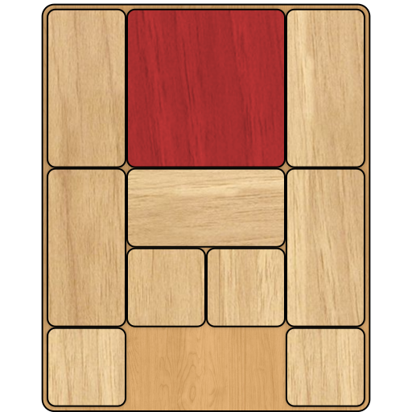

# Table of Contents
1. [Introduction](#Introduction)
2. [Problem representation](#Problem-representation)
3. [Input data](#Input-data)
4. [Output data](#Output-data)
5. [Heuristics](#Heuristics)
6. [Code optimizations](#Code-optimizations)
7. [Algorithm comparasion](#Algorithm-comparasion)
8. [Running the program](#Running-the-program)

# Introduction

[Klotski](https://en.wikipedia.org/wiki/Klotski) is a sliding block puzzle. The goal of this game is to move each piece in any of the 4 directions (up, right, down, left) until you manage to get the special piece out of the board (usually through an exit in the top border). 

The original Klotski puzzle consisted of 10 blocks and can be solve in a minimum of 81 moves:



# Problem representation

### **Encoding**:
In order to memorize a board we need to encode the configuration:
1. '#' - border of the current state
2. '.' - free space on the board
3. '*' - part of the special piece
4. 'a'-'z' or 'A'-'Z' for other pieces

Each board configuration is stored in the memory via the SearchNode class.

### **Rules**:
* The puzzle has an exit at the top of the board which fits perfectly with the special piece
* The pieces of the puzzle can have any shape
* Each piece can be moved one step at a time, in any of the 4 directions (top, right, down left) only if it has enough free space to move there
* Each piece has to be moved entirely (you cannot break the piece and move only parts of it)
* Only the special piece can exit the puzzle through the exit at the top
* The cost of each move is equal to the size of the pieced move (except the special piece which always has a cost of 1)
* The puzzle is considered solved when the special piece is no longer on the board

### **Solving the problem**:
In order to solve this problem, we will represent each set of moves as a path in a graph, using the Graph class. We will try to build this path step by step using different searching algorithms.
List of used algorithms:
* Breadth First Search (BFS)
* Depth First Search (DFS - recursive)
* Iterative Depth First Search (IDFS)
* A Star (A*)
* Optimized A Star (A* opt)
* Iterative A Star (IDA*)


# Input data
The program reads from a file the initial board state, using the already mentioned encoding. Before starting to search for a solution, the correctness of the input is automatically checked. If the input is invalid, the program will prompt out in an output file suggestive messages that will help the user to make changes to their input until they provide a valid one.


The input_folder contains 4 examples of a valid input with the following properties:
* the first file is valid, but it doesn't have any solutions
* the second file has a valid board that is already solved
* the third one has an easy puzzle to solve
* the fourth file has a bigger puzzle that will block some of the slower searching algorithms

# Output data
For each input file, the program generates an output file with the corresponding solutions. The solutions will be grouped by the algorithm that provided them. Instead of a solution, the user can expect a descriptive error message to be prompted out in the output file if the algorithm fails in any way (for example, the algorithm takes too much time to run, or there are no more solutions to be printed out).
Each solution consists of:
* The set of moves that get the board from the start state to a final state
* The total cost of this solution
* The time of generating the solution
* Maximum number of nodes computed at a step
* Maximum number of nodes in memory at any step

# Heurisitics
The A* algorithm needs a heuristic function that will approximate the number of steps needed to reach a final state. In this program we used 4 diffrent heuristics (3 admissible ones and one non-admissible)

1. Trivial heuristic: this heuristic returns 1 if the current state is not a final state or 0 otherwise. This is clearly an admissible heuristic because if the current state of the board is not final, at least one move is needed to reach a final state.

2. Admissible heuristic 1 (Manhattan distance): this heuristic returns the minimum number of moves needed to get the special piece out of the puzzle if the puzzle contained no obstacles. This heuristic is admissible because it uses a best-case scenario, where the special piece isn't blocked by any obstacle, when in reality, additional moves may be needed in order to follow that path. A little optimization of this heuristic is to also add the cost of moving once every obstacle that occupies at least a cell of the exit.

3. Admissible heuristic 2: This heuristic estimates the number of moves by analyzing each set of L columns on the board (where L is the width of the special piece). For each set of columns, the function calculates the cost of getting to that position, then all the way up to the first row and then to the exit. If in this path the special piece collides with an obstacle, the cost of moving the obstacle is added as well and the obstacle is removed. Lastly, the function returns the path with the minimum value. This heuristic is admissible because it basically analyzes every path that the special piece can take. If an obstacle is in the way we only add its cost once, but in reality, the cost can be only equal or greater because we might need to move more pieces in order to free that path. 

4. Non-admissible heuristic: This takes the first heuristic h1(x) and returns 2 * h(x) + 1. This heuristic assumes a worst-case scenario where every cell in the path is blocked by an obstacle of cost 1. It is clear that this formula overestimates the number of steps, especially for boards with fewer obstacles, thus this heuristic is not admissible.

# Code optimizations
Some of the code optimizations made to achieve better performances:
* At different points in the algorithm, we need the exact coordinates of the special piece. Every SearchNode object memorizes these coordinates in order to respond in **O(1)** to this request
* For the same reason, the Graph class memorizes the coordinates of the exit as well as a dictionary of obstacles, where the key is the letter representing the piece and the value is the cost of moving it
* overwritten ```__eq__``` and ```__hash__``` in SearchNode class to improve the speed of comparison between nodes
* If the input is already in a final state or if it doesn't have any solutions, a message will be printed out instead of running the algorithms
* Used different data structures (such as `Queue` and `PriorityQueue`) to get a better performance out of the searching algorithms

### **Time complexities**:
* comparing 2 nodes: **O(1)**
* checking if the node was already visited, printing the path: **O(L)** - where L is the length of the path
* finding the coordinates of the special_piece: **O(BoardWidth^2)** for the first node, **O(1)** in other cases
* final state test **O(1)**
* first heuristic **O(1)**, second **O(SpecialPieceWidth)**, third heuristic **O(BoardWidth^2)**, last **O(SpecialPieceWidth)**
* generating successors **O(k * N^2)** - where k is the number of pieces that can be moved and N is the size of the board 

# Algorithm comparison
The following table summarizes the results and performances of each searching algorithm on the 4 input files provided.
For all the algorithms 2 different paths are required, and the timeout is 5 seconds.

#### BFS
| Input file  | Lenght      |   Cost      | Time (s)    |  MemMax     |  NMax       |   Sol Idx   |
| ----------- | ----------- | ----------- | ----------- | ----------- | ----------- | ----------- |
| 3           | 9           | 11          | 1.2836      | 26574       | 36315       | 1           |
| 3           | 9           | 11          | 1.3065      | 27068       | 36999       | 2           |
| 4           | -           | -           | TLE (>5)    | -           | -           | 1           |
| 4           | -           | -           | TLE (>5)    | -           | -           | 2           |

#### DFS
| Input file  | Lenght      |   Cost      | Time (s)    |  MemMax     |  NMax       |   Sol Idx   |
| ----------- | ----------- | ----------- | ----------- | ----------- | ----------- | ----------- |
| 3           | 244         | 475         | 0.0469      | 248         | 931         | 1           |
| 3           | 246         | 479         | 0.0499      | 250         | 935         | 2           |
| 4           | 987         | 2137        | 0.4668      | 4821        | 981         | 1           |
| 4           | 986         | 2135        | 0.4748      | 4822        | 990         | 2           |

#### IDFS
| Input file  | Lenght      |   Cost      | Time (s)    |  MemMax     |  NMax       |   Sol Idx   |
| ----------- | ----------- | ----------- | ----------- | ----------- | ----------- | ----------- |
| 3           | 9           | 11          | 1.2836      | 5           | 40          | 1           |
| 3           | 9           | 11          | 1.3065      | 5           | 45          | 2           |
| 4           | -           | -           | TLE (>5)    | -           | -           | 1           |
| 4           | -           | -           | TLE (>5)    | -           | -           | 2           |

#### A*
| Input file  | Lenght      |   Cost      | Time (s)    | Heuristic   |  MemMax     |  NMax       |   Sol Idx   |
| ----------- | ----------- | ----------- | ----------- | ----------- | ----------- | ----------- | ----------- |
| 3           | 9           | 11          | 0.0209      | trivial     | 78          | 522         | 1           |
| 3           | 10          | 12          | 0.0269      | trivial     | 90          | 663         | 2           |
| 4           | 10          | 12          | 0.0918      | trivial     | 331         | 1657        | 1           |
| 4           | 11          | 13          | 0.1486      | trivial     | 440         | 2353        | 2           |
| 3           | 9           | 11          | 0.012       | admissible1 | 58          | 308         | 1           |
| 3           | 10          | 13          | 0.012       | admissible1 | 61          | 313         | 2           |
| 4           | 10          | 12          | 0.0269      | admissible1 | 151         | 539         | 1           |
| 4           | 11          | 13          | 0.0279      | admissible1 | 156         | 545         | 2           |
| 3           | 9           | 11          | 0.008       | admissible2 | 51          | 150         | 1           |
| 3           | 10          | 12          | 0.008       | admissible2 | 55          | 155         | 2           |
| 4           | 10          | 12          | 0.009       | admissible2 | 76          | 142         | 1           |
| 4           | 11          | 13          | 0.012       | admissible2 | 97          | 189         | 2           |
| 3           | 9           | 11          | 0.007       | non-adm     | 49          | 176         | 1           |
| 3           | 10          | 13          | 0.007       | non-adm     | 53          | 181         | 2           |
| 4           | 10          | 12          | 0.0249      | non-adm     | 145         | 542         | 1           |
| 4           | 11          | 13          | 0.0249      | non-adm     | 150         | 548         | 2           |


#### A* OPT
| Input file  | Lenght      |   Cost      | Time (s)    | Heuristic   |  MemMax     |  NMax       | 
| ----------- | ----------- | ----------- | ----------- | ----------- | ----------- | ----------- | 
| 3           | 9           | 11          | 0.013       | trivial     | 107         | 321         | 
| 4           | 10          | 12          | 0.0598      | trivial     | 385         | 978         | 
| 3           | 9           | 11          | 0.009       | admissible1 | 92          | 218         |
| 4           | 10          | 12          | 0.018       | admissible1 | 196         | 358         |
| 3           | 9           | 11          | 0.007       | admissible2 | 81          | 139         |
| 4           | 10          | 12          |             | admissible2 | 106         | 136         |
| 3           | 9           | 11          | 0.004       | non-adm     | 70          | 120         |
| 4           | 10          | 12          | 0.014       | non-adm     | 178         | 321         |

#### IDA*
| Input file  | Lenght      |   Cost      | Time (s)    | Heuristic   |  MemMax     |  NMax       |   Sol Idx   |
| ----------- | ----------- | ----------- | ----------- | ----------- | ----------- | ----------- | ----------- |
| 3           | 9           | 11          | 0.4438      | trivial     | 5           | 31          | 1           |
| 3           | 9           | 11          | 0.4628      | trivial     | 5           | 34          | 2           |
| 4           | -           | -           | TLE (>5)    | trivial     | -           | -           | 1           |
| 4           | -           | -           | TLE (>5)    | trivial     | -           | -           | 2           |
| 3           | 9           | 11          | 0.0409      | admissible1 | 5           | 31          | 1           |
| 3           | 9           | 11          | 0.0429      | admissible1 | 5           | 36          | 2           |
| 4           | 10          | 12          | 0.358       | admissible1 | 6           | 44          | 1           |
| 4           | 11          | 13          | 0.358       | admissible1 | 6           | 50          | 2           |
| 3           | 9           | 11          | 0.0249      | admissible2 | 5           | 31          | 1           |
| 3           | 10          | 12          | 0.0249      | admissible2 | 5           | 36          | 2           |
| 4           | 10          | 12          | 0.0599      | admissible2 | 6           | 44          | 1           |
| 4           | 11          | 13          | 0.3351      | admissible2 | 6           | 49          | 2           |
| 3           | 10          | 13          | 0.011       | non-adm     | 6           | 41          | 1           |
| 3           | 11          | 15          | 0.011       | non-adm     | 6           | 47          | 2           |
| 4           | 14          | 16          | 0.2234      | non-adm     | 9           | 64          | 1           |
| 4           | 15          | 17          | 0.2244      | non-adm     | 9           | 71          | 2           |


# Running the program
In order to run the program you need to provide all the needed arguments:
1. -if (input folder): path to the input folder
2. -of (output folder): path to the output folder
3. -nsol (number of solutions): how many solutions should the search algorithms print
4. -he (heuristic): what type of heuristic should be use (can be: "trivial", "admissible1", "admissible2", "non-admissible")
5. -t (timeout): after how many seconds the algorithm should stop searching for the solution

You can run this program by opening your terminal and using the `python` or `python3` command.

### **Syntax**:

```
$ python main.py -if $input_folder -of $output_folder -nsol $num_of_solutions -he $heuristic -t $timeout 
```
### **Examples**:
```
$ python main.py -if input_folder -of output_folder -nsol 1 -he trivial -t 20 
```

```
$ python main.py --input_folder input_folder --output_folder output_folder -nsol 4 --heuristic "admissible2" --timeout 5 
```
You can also run this program in PyCharm by setting up the program variables from *Run -> Edit configurations -> Parameters*.


This project was built using `Python 3.10.3` version.
